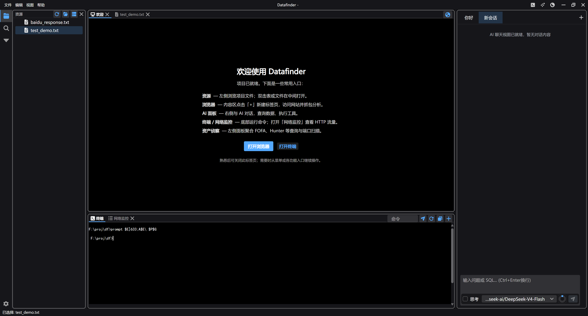
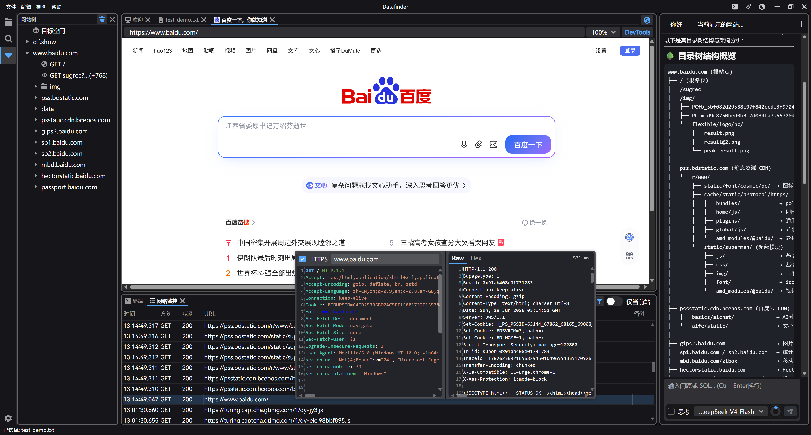

# 烬 ZeroFall

面向攻防与情报分析——**类 Burp Suite** 的 HTTP 流量截获、检视与重放，再叠加资产测绘、SQL 分析、AI 助手与交互式终端，统一在一个项目里完成。

打开文件夹即项目；侦察结果、流量记录与终端记录落在项目本地数据库（`.zerofall.db`）中，便于用 SQL 与 AI 在同一工作区内分析。

---

## 界面预览

**主界面** — 五区域 Dock 布局：资源树、浏览器、终端/流量、AI 面板一屏协作。



**浏览器与 AI 协作** — 网站树、流量监控、HTTP 检视与 AI 分析同一工作流（类 Burp Suite + 助手）。



---

## 为什么用 烬

- **类 Burp Suite**：内置浏览器 + 本地拦截代理，HTTP(S) 流量全量入库；支持检视、重放、Intruder、Decoder/Diff 等 HTTP 工作流，网站树按会话组织请求。
- **一张工作台**：测绘、抓包、查库、跑命令、问 AI 不必在多个工具间来回倒数据。
- **从源码运行**：基于 .NET SDK 构建，便于阅读、修改与二次开发。

---

## 能做什么

| 能力 | 说明 |
|------|------|
| **HTTP 流量（类 Burp）** | 内置浏览器经本地 Fluxzy 网关截获，历史流量 SQLite 持久化，重放与 Intruder，请求/响应高亮检视 |
| **项目管理** | 打开工作目录，侧边栏文件树，数据文件索引入库 |
| **SQL 分析** | 内置编辑器与结果表格，查询项目数据库 |
| **文件编辑** | AvaloniaEdit 编辑与保存；Markdown 等文件预览 |
| **资产测绘** | FOFA / Hunter / Quake / Shodan 等多源聚合、去重与入库 |
| **AI 助手** | OpenAI 兼容 API，WebView 流式对话，内置工具与 MCP，可联动终端与项目数据 |
| **交互式终端** | 多会话 PTY，可与 AI 协同 |
| **代理** | 本地拦截网关与浏览器及出站请求联动 |

---

## 环境要求

- **操作系统**：Windows 10/11（x64）
- **.NET SDK**：[.NET 10 SDK](https://dotnet.microsoft.com/download)
- **WebView2**：[Microsoft Edge WebView2 Runtime](https://developer.microsoft.com/microsoft-edge/webview2/)（浏览器、AI 聊天与流量相关功能需要）

修改 AI 聊天前端 `ai-chat-web` 时需 Node.js。

---

## 从源码构建与运行

```bash
dotnet restore
dotnet build src/ZeroFall.App/ZeroFall.App.csproj
dotnet run --project src/ZeroFall.App/ZeroFall.App.csproj
```

修改 `ai-chat-web` 后：

```bash
cd src/ZeroFall.AiPanel/ai-chat-web
npm install
npm run build
cd ../../..
dotnet build src/ZeroFall.App/ZeroFall.App.csproj
```

### 使用步骤

1. **打开文件夹** 选择工作目录  
2. 在 **设置** 中按需配置 AI API、资产测绘 Key、代理等  
3. 新建浏览器标签抓包（TopBar 地球图标，或 **视图 → 新建浏览器标签**），底部 **网络监控** 查看流量  
4. 查看 HTTPS 明文时，在 **设置 → 代理** 开启 **HTTPS 解密** 并信任 Fluxzy 根证书  
5. 用 SQL / AI / 终端继续分析  

> 使用 AI、资产测绘、MCP 等功能前，请先在设置中完成相关配置。各测绘源 API Key 由用户自行申请，费用与配额以各平台为准。

---

## 免责声明

本软件仅供**授权**的安全测试、研究与学习使用。使用者须遵守当地法律法规，对使用本软件产生的一切行为自行负责。向第三方测绘平台发起的查询及产生的费用，由使用者自行承担。
